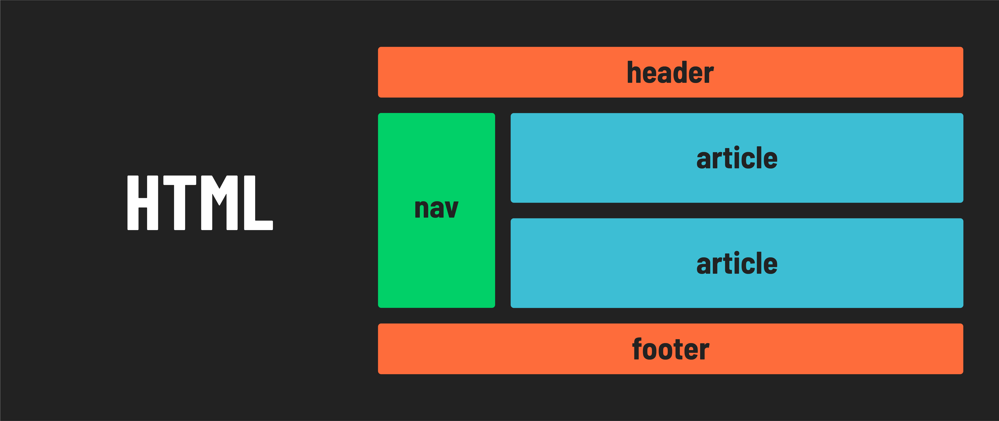

<h1>
  Intro to HTML
  Semantic HTML
</h1>

**Learning objective:** By the end of this lesson, learners will be able to apply semantic HTML tags to enhance the structure, accessibility, and SEO of a webpage.

## Semantic HTML

Semantic HTML helps express the meaning or purpose of the content in a webpage:

Semantic HTML clarifies the developer's intentions about what they are trying to accomplish when structuring a page. It also improves accessibility for the visually impaired enabling screen readers to do their job better.

It also allows for more accurate web searches via better SEO (*search engine optimization*).

> 📚 The goals of *search engine optimization* are to increase the quantity and quality of traffic to a website through search engine results. It involves making changes (including using semantic HTML) to a website to make it more attractive to search engines.

## 🎓 You Do

Take some time to research these semantic HTML tags. Research how these tags differ from the non-descriptive `
` element.

1. `<section>`
2. `<article>`
3. `<aside>`
4. `<figure>`
5. `<main>`
6. `<footer>`
7. `<header>`
8. `<nav>`
