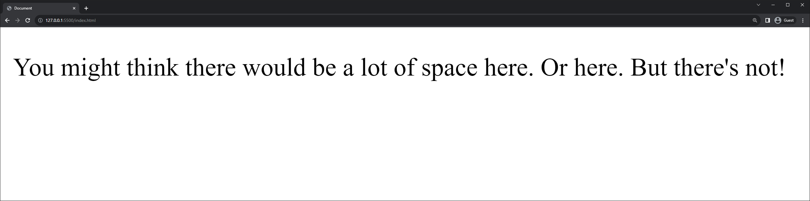

<h1>
  <span class="headline">Intro to HTML</span>
  <span class="subhead">Structural Pitfalls</span>
</h1>

**Learning objective:** By the end of this lesson, students will be able to identify and correct common structural pitfalls in HTML to provide a deeper understanding of formatting to help avoid common errors.

## Whitespace

Multiple spaces created using the `spacebar`, `tab`, and `return` keys are rendered as a single space character between elements and text.

```html
<p>
  You might think there would be a lot of              space here.


  Or here.


  But there's not!
</p>
```

Here is the result of the above HTML:



When you want space between text and elements you should typically create it using CSS. As an additional option you can use the `&nbsp;` (non-breaking space) [HTML Entity](https://developer.mozilla.org/en-US/docs/Glossary/Entity) or the `<br>` or break element.

## Malformed HTML

Proper structure and nesting of elements are important because the browser won't complain - it just won't necessarily display what you expect. One of the possible mistakes is to "overlap" tags instead of nesting them. Here's an example of malformed HTML:

```html
<p>This is <strong>important text</p></strong>
```

Errors in complex HTML can be hard to find, so it's not uncommon for Developers to use plugins or other tools to help them find errors. [Here is a tool](https://www.10bestdesign.com/dirtymarkup/) that finds errors in HTML that you provide.

> ⚠ Unlike JavaScript, our browsers will not complain if we make HTML or CSS mistakes. Instead, it just transparently does its best to correct our mistakes or fail.
